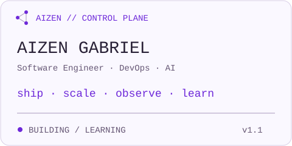
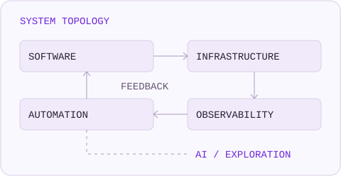
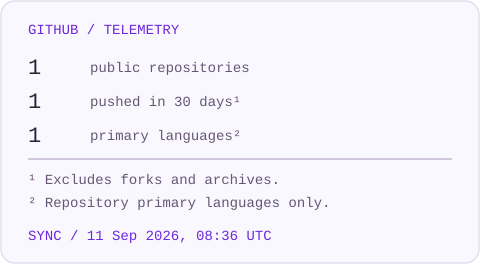
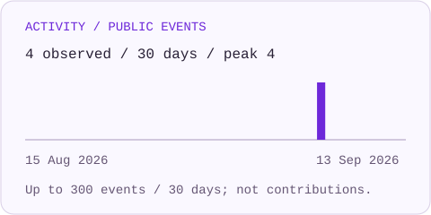

  

<!-- AUTO-GENERATED: scripts/generate_profile.py; edit config/profile.yaml. -->

#### 01 / IDENTITY

`$ whoami`

I build software, automate infrastructure, and explore systems where engineering and artificial intelligence converge.

Inspect Engineer Resource

**Engineering**

Backend Engineering · APIs · System Architecture · Distributed Systems · Automation

**Infrastructure**

Containers · Kubernetes · Infrastructure as Code · CI/CD · Linux · Observability

**Artificial Intelligence**

LLM Applications · AI Agents · RAG · AI Automation · AI Infrastructure

#### 02 / FEATURED PROJECT

**Aizen Control Plane** — A small GitHub profile system, built to maintain itself.

Python · SVG · YAML · GitHub Actions

[Source](https://github.com/AizenGabriel/AizenGabriel) · [How It Works](./docs/DEVELOPMENT.md)

#### 03 / ARCHITECTURE

I build systems that operate software — and explore systems that reason about it.

  

#### 04 / PUBLIC TELEMETRY

  

  

Refreshed daily. Public events are a bounded sample, not commit totals. [Data & Last Sync](./assets/generated/telemetry.json) · [Metric Definitions](./docs/DEVELOPMENT.md#metric-contracts)

#### 05 / CONNECT

[github](https://github.com/AizenGabriel)

`$ exit 0`

<!--
Source inspection acknowledged.
$ control-plane inspect --layer beneath-the-interface
ACCESS: ENGINEER
The next layer is the system that keeps this one honest.
Trace: scripts/lib/github.py
-->
